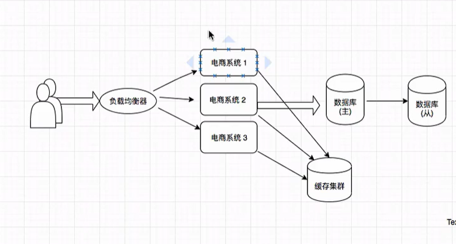
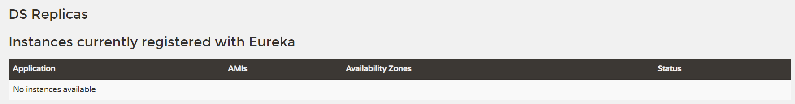

## SpringCloud学习

1.IDEA JDK8 Maven SpringBoot基础 Linux

2.理解掌握SpringCloud里主流架构和组件的基础使用 部分源码的理解

3.掌握学习的技巧与解决问题的思路

一 架构演进与分布式系统基础知识

1.传统架构演变到分布式

（1）

（2）

（3）

建立第一个eureka注册中心时 记得勾选 Cloud Discovry -->  Eureka Server

此处代表注册的服务数，此处暂无注册
