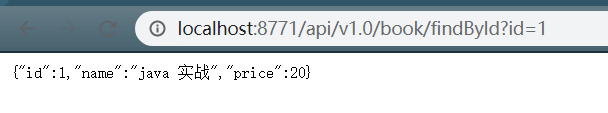
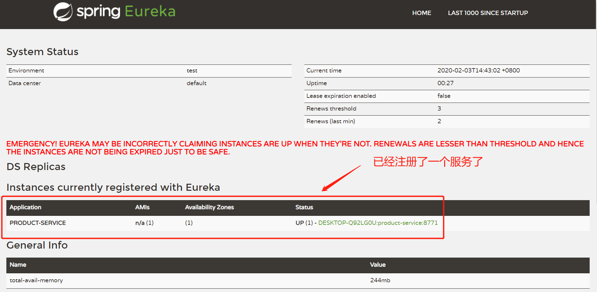

## 2.给注册中心注册第一个Springboot服务

以一个商品服务为例子，搭建一个商品服务，并将服务注册到注册中心

1.模拟一个Springboot应用 创建时候 要勾选 Cloud Discovery(注册中心)-->Eureka Discovery  添加服务注册与依赖

2.模拟商品信息，存储在内存中

3.开发商品列表接口，商品详情接口

4.配置文件加入注册中心地址

Eureka的自我保护机制可以使得 即使某个微服务挂了 也能提供服务 不至于影响用户体验